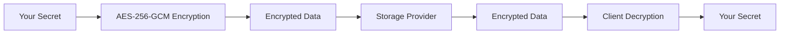

# Security Best Practices

Learn how to secure your environment variables and follow industry best practices with EnvFly CLI.

## Overview

Security is paramount when managing environment variables, especially in production environments. This guide covers comprehensive security practices to ensure your sensitive data remains protected.

## Encryption Fundamentals

### Client-Side Encryption

EnvFly CLI uses client-side encryption to ensure your data is never stored in plain text:



<AccordionGroup>
  <Accordion title="Encryption Algorithm">
    **AES-256-GCM** with PBKDF2 key derivation - **Key Size**: 256 bits (maximum
    security) - **Mode**: GCM (Galois/Counter Mode) for authenticated encryption
    - **Key Derivation**: PBKDF2 with 100,000 iterations - **Salt**: Random
    32-byte salt per variable - **Nonce**: Random 12-byte nonce per encryption
  </Accordion>

  <Accordion title="Key Management">
    - **Master Key**: Derived from your password/API key - **Variable Keys**:
    Unique per variable for isolation - **Key Storage**: Never stored on server
    (zero-knowledge) - **Key Rotation**: Automatic with password change - **Key
    Backup**: Secure backup of master key only
  </Accordion>

  <Accordion title="Zero-Knowledge Architecture">
    - Server cannot decrypt your data - Only you have access to encryption keys
    - No backdoor access possible - Compliant with strict security requirements
    - Audit trail without exposing data
  </Accordion>
</AccordionGroup>

## Access Control

### Authentication

<Callout type="warning">
  **Critical**: Always use strong, unique passwords and enable two-factor
  authentication where available.
</Callout>

<AccordionGroup>
  <Accordion title="API Key Management">
    ```bash # Generate strong API key openssl rand -base64 32 # Store securely
    envfly login ``` **Best Practices**: - Use 32+ character random keys -
    Rotate keys every 90 days - Use different keys for different environments -
    Never share keys in code or logs
  </Accordion>

  <Accordion title="Team Access Control">
    ```bash # Create team with specific permissions envfly team create "Backend
    Team" --role admin # Invite members with read-only access envfly team invite
    alice@company.com --role read ``` **Roles**: - **Admin**: Full access to all
    environments - **Write**: Can modify assigned environments - **Read**: Can
    view assigned environments - **Audit**: Can view logs and history only
  </Accordion>

  <Accordion title="Environment Isolation">
    ```bash # Separate environments by team envfly team assign "Backend Team"
    production envfly team assign "Frontend Team" staging ``` **Benefits**: -
    Limit access to sensitive environments - Reduce blast radius of compromised
    credentials - Enable granular permissions - Audit access by environment
  </Accordion>
</AccordionGroup>

## Environment Variable Security

### Naming Conventions

<Table>
  <TableHead>
    <TableRow>
      <TableHeader>Category</TableHeader>
      <TableHeader>Prefix</TableHeader>
      <TableHeader>Examples</TableHeader>
      <TableHeader>Security Level</TableHeader>
    </TableRow>
  </TableHead>
  <TableBody>
    <TableRow>
      <TableCell>**Database**</TableCell>
      <TableCell>`DB_`</TableCell>
      <TableCell>`DB_HOST`, `DB_PASSWORD`</TableCell>
      <TableCell>🔒🔒 High</TableCell>
    </TableRow>
    <TableRow>
      <TableCell>**API Keys**</TableCell>
      <TableCell>`API_`</TableCell>
      <TableCell>`API_KEY`, `API_SECRET`</TableCell>
      <TableCell>🔒🔒🔒 Critical</TableCell>
    </TableRow>
    <TableRow>
      <TableCell>**Authentication**</TableCell>
      <TableCell>`AUTH_`</TableCell>
      <TableCell>`AUTH_SECRET`, `JWT_SECRET`</TableCell>
      <TableCell>🔒🔒🔒 Critical</TableCell>
    </TableRow>
    <TableRow>
      <TableCell>**External Services**</TableCell>
      <TableCell>`SERVICE_`</TableCell>
      <TableCell>`SERVICE_TOKEN`, `SERVICE_URL`</TableCell>
      <TableCell>🔒🔒 High</TableCell>
    </TableRow>
    <TableRow>
      <TableCell>**Configuration**</TableCell>
      <TableCell>`CONFIG_`</TableCell>
      <TableCell>`CONFIG_DEBUG`, `CONFIG_PORT`</TableCell>
      <TableCell>🔒 Low</TableCell>
    </TableRow>
  </TableBody>
</Table>

### Secret Management

<AccordionGroup>
  <Accordion title="Secret Generation">
    ```bash # Generate strong secrets openssl rand -base64 32 # For API keys
    openssl rand -hex 32 # For JWT secrets openssl rand -base64 24 # For
    database passwords # Store securely envfly push production
    API_KEY="$(openssl rand -base64 32)" ```
  </Accordion>

  <Accordion title="Secret Rotation">
    ```bash # Rotate secrets regularly envfly push production
    API_KEY="new_key_$(date +%s)" envfly push production
    JWT_SECRET="new_jwt_$(date +%s)" # Notify team of rotation envfly team
    notify production "Secrets rotated on $(date)" ```
  </Accordion>

  <Accordion title="Secret Validation">
    ```bash # Validate secrets meet requirements envfly validate production
    --check-secrets # Check for weak secrets envfly audit --check-weak-secrets
    ```
  </Accordion>
</AccordionGroup>

## Network Security

### Transport Security

<AccordionGroup>
  <Accordion title="HTTPS/TLS">
    - Always use HTTPS for API communication - Verify SSL certificates - Use TLS
    1.3 when available - Implement certificate pinning for critical endpoints
  </Accordion>

  <Accordion title="Network Isolation">
    - Use VPN for remote access - Implement network segmentation - Restrict
    access to management interfaces - Monitor network traffic for anomalies
  </Accordion>

  <Accordion title="Firewall Rules">
    ```bash # Example firewall rules # Allow EnvFly CLI access only from trusted
    IPs iptables -A INPUT -s 192.168.1.0/24 -p tcp --dport 443 -j ACCEPT
    iptables -A INPUT -p tcp --dport 443 -j DROP ```
  </Accordion>
</AccordionGroup>

## Storage Provider Security

### Cloud Provider Security

<Grid cols={2}>
  <Card title="AWS S3 Security">
    - Enable bucket encryption - Use IAM roles and policies - Enable access
    logging - Configure bucket policies - Use VPC endpoints
  </Card>
  <Card title="Azure Blob Security">
    - Enable storage encryption - Use Azure AD authentication - Configure access
    policies - Enable soft delete - Use private endpoints
  </Card>
  <Card title="Google Cloud Security">
    - Enable bucket encryption - Use IAM permissions - Configure access controls
    - Enable audit logging - Use VPC service controls
  </Card>
  <Card title="Git Repository Security">
    - Use SSH keys for access - Enable branch protection - Require code review -
    Enable security scanning - Use signed commits
  </Card>
</Grid>

### Access Control Lists

```bash
# Example S3 bucket policy
{
  "Version": "2012-10-17",
  "Statement": [
    {
      "Sid": "EnvFlyAccess",
      "Effect": "Allow",
      "Principal": {
        "AWS": "arn:aws:iam::123456789012:role/EnvFlyRole"
      },
      "Action": [
        "s3:GetObject",
        "s3:PutObject",
        "s3:DeleteObject"
      ],
      "Resource": "arn:aws:s3:::my-env-vars/environments/*"
    }
  ]
}
```

## Monitoring and Auditing

### Audit Logging

<AccordionGroup>
  <Accordion title="Access Logs">
    ```bash # View access logs envfly audit --environment production --last 7d #
    Export audit logs envfly audit --export --format json > audit-logs.json ```
  </Accordion>

  <Accordion title="Change Tracking">
    ```bash # View variable changes envfly history --environment production #
    Track specific variable envfly history --variable API_KEY ```
  </Accordion>

  <Accordion title="Alerting">
    ```bash # Set up alerts for suspicious activity envfly alert create --type
    "failed-login" --webhook "https://hooks.slack.com/..." envfly alert create
    --type "variable-change" --webhook "https://hooks.slack.com/..." ```
  </Accordion>
</AccordionGroup>

### Security Monitoring

```yaml
# Example monitoring configuration
monitoring:
  alerts:
    - name: "Failed Login Attempts"
      condition: "failed_logins > 5 in 1h"
      action: "webhook"
      webhook_url: "https://security.example.com/alert"

    - name: "Sensitive Variable Changes"
      condition: "variable_changed matches '.*SECRET.*'"
      action: "email"
      email: "security@company.com"

    - name: "Unauthorized Access"
      condition: "access_denied > 3 in 10m"
      action: "block_ip"
      duration: "1h"
```

## Compliance and Governance

### Regulatory Compliance

<AccordionGroup>
  <Accordion title="GDPR Compliance">
    - Data encryption at rest and in transit - Right to be forgotten (data
    deletion) - Data portability (export capabilities) - Consent management -
    Audit trails for data access
  </Accordion>

  <Accordion title="SOC 2 Compliance">
    - Access control and authentication - Audit logging and monitoring - Change
    management procedures - Incident response procedures - Regular security
    assessments
  </Accordion>

  <Accordion title="HIPAA Compliance">
    - Encryption of PHI data - Access controls and authentication - Audit trails
    for all access - Data backup and recovery - Business associate agreements
  </Accordion>
</AccordionGroup>

### Security Policies

```markdown
# Security Policy Template

## Access Control

- All access requires authentication
- Use strong, unique passwords
- Enable two-factor authentication
- Regular access reviews

## Data Protection

- Encrypt all sensitive data
- Use client-side encryption
- Regular security assessments
- Incident response procedures

## Monitoring

- Monitor all access attempts
- Alert on suspicious activity
- Regular audit log reviews
- Security incident reporting
```

## Incident Response

### Security Incident Procedures

<Steps>
  <Step title="Detection">
    Monitor for: - Failed login attempts - Unusual access patterns -
    Unauthorized variable changes - Network anomalies
  </Step>

  <Step title="Assessment">
    - Determine scope of incident - Identify affected environments - Assess data
    exposure - Notify stakeholders
  </Step>

  <Step title="Containment">
    - Revoke compromised credentials - Block suspicious IP addresses - Rotate
    affected secrets - Isolate affected systems
  </Step>

  <Step title="Recovery">
    - Restore from backups if needed - Implement additional security measures -
    Update security policies - Conduct post-incident review
  </Step>
</Steps>

### Incident Response Script

```bash
#!/bin/bash
# incident-response.sh

echo "Security Incident Response Script"
echo "=================================="

# 1. Revoke all API keys
echo "Revoking all API keys..."
envfly team revoke-all-keys

# 2. Rotate all secrets
echo "Rotating all secrets..."
envfly rotate-secrets --all-environments

# 3. Export audit logs
echo "Exporting audit logs..."
envfly audit --export --format json > incident-logs-$(date +%Y%m%d-%H%M%S).json

# 4. Notify team
echo "Notifying team..."
envfly team notify all "Security incident detected. All keys rotated."

echo "Incident response complete."
```

## Security Checklist

<AccordionGroup>
  <Accordion title="Initial Setup">
    - [ ] Enable client-side encryption - [ ] Use strong API keys - [ ] Enable
    two-factor authentication - [ ] Configure access controls - [ ] Set up audit
    logging
  </Accordion>

  <Accordion title="Regular Maintenance">
    - [ ] Rotate secrets every 90 days - [ ] Review access logs monthly - [ ]
    Update security policies - [ ] Conduct security assessments - [ ] Test
    incident response procedures
  </Accordion>

  <Accordion title="Monitoring">
    - [ ] Set up security alerts - [ ] Monitor access patterns - [ ] Review
    audit logs - [ ] Test backup procedures - [ ] Validate encryption
  </Accordion>
</AccordionGroup>

## Security Tools Integration

### Security Scanning

```bash
# Integrate with security tools
envfly export --format json | security-scanner --input -

# Check for secrets in code
grep -r "API_KEY\|SECRET\|PASSWORD" . --exclude-dir=node_modules

# Validate environment security
envfly validate --security-check
```

### Vulnerability Management

```yaml
# Security scanning configuration
security:
  scanning:
    - tool: "snyk"
      command: "snyk test"
      schedule: "daily"

    - tool: "bandit"
      command: "bandit -r ."
      schedule: "weekly"

    - tool: "envfly-security"
      command: "envfly audit --security"
      schedule: "daily"
```

## Related Topics

<Grid cols={3}>
  <Card title="Encryption" href="/concepts/encryption">
    Learn about encryption algorithms and key management.
  </Card>
  <Card title="Teams" href="/concepts/teams">
    Manage team access and permissions.
  </Card>
  <Card title="Audit Logs" href="/commands/audit">
    Monitor and review access logs.
  </Card>
</Grid>{" "}
